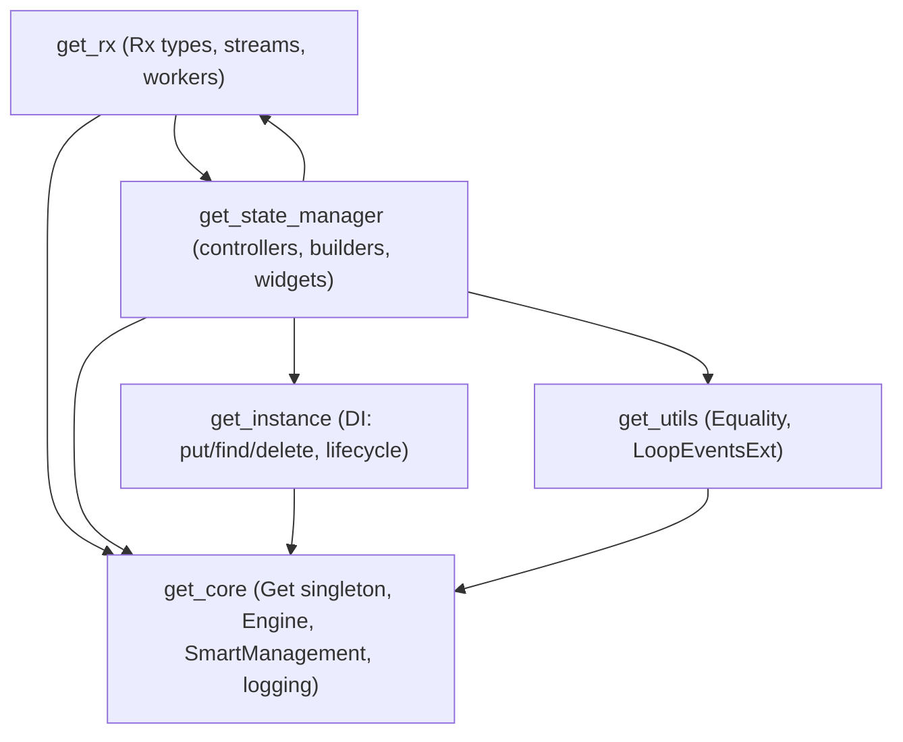

# Strip GetX Down to State Management Only

## Scope Analysis

The GetX package has these modules. Modules marked **KEEP** are required by state management; modules marked **REMOVE** are not.

### KEEP (state management and its hard dependencies)

- **`get_state_manager/`** -- The core state management widgets and controllers (`GetxController`, `GetBuilder`, `Obx`, `Bind`, `GetView`, `GetWidget`, `StateMixin`, `GetNotifier`, ticker mixins, etc.) -- **excluding** `get_responsive.dart` (removed)
- **`get_rx/`** -- The reactive system (`Rx`, `RxList`, `RxMap`, `RxSet`, `RxInterface`, `MiniStream`, workers like `ever`/`debounce`/`once`/`interval`, `Worker`, `Debouncer`)
- **`get_instance/`** -- Dependency injection (`Get.put`, `Get.find`, `Get.lazyPut`, `Get.delete`, `GetLifeCycleMixin`, `GetxService`, `BindingsInterface`)
- **`get_core/`** -- Foundation layer (`GetInterface`, `Get` singleton, `SmartManagement`, `Engine`, logging, typedefs)
- **`get_utils/src/equality/`** -- `Equality` mixin used by `GetStatus` in `rx_notifier.dart`
- **`get_utils/src/extensions/event_loop_extensions.dart`** -- `LoopEventsExt` (`Get.asap`, `Get.toEnd`) used by `get_view.dart`

### REMOVE (everything else)

- **`get_navigation/`** -- Router, GetMaterialApp, GetCupertinoApp, snackbars, dialogs, bottomsheets, transitions, route middleware, URL strategy, route observer (34 files)
- **`get_connect/`** -- HTTP client, sockets, certificates, multipart, interceptors (20 files)
- **`get_animations/`** -- Animation builders and extensions (4 files)
- **`get_common/`** -- `GetResetExt` (depends on navigation via `clearTranslations`)
- **`lib/src/responsive/size_percent_extension.dart`** -- Unrelated utility
- **`get_utils/` except equality and event_loop_extensions above** -- General utilities (`GetUtils` validation helpers, all context/string/num/double/int/duration/dynamic/widget/iterable extensions, internationalization, platform detection, queue, optimized ListView)
- **`get_state_manager/src/simple/get_responsive.dart`** -- `GetResponsiveView`, `GetResponsiveWidget`, `ResponsiveScreen` (not needed)
- **Tests** for removed modules (`test/animations/`, `test/navigation/`, `test/internationalization/`, `test/utils/` except possibly context-extension-related, `test/benchmarks/`)
- **Documentation** for removed modules (`documentation/en_US/route_management.md`, `documentation/en_US/dependency_management.md`)

---

## Dependency Surgery Required

There are several cross-module references that must be severed:

### 1. `extension_instance.dart` imports `RouterReportManager`

[`lib/get_instance/src/extension_instance.dart`](lib/get_instance/src/extension_instance.dart) imports `get_navigation/src/router_report.dart` for `RouterReportManager`. This class tracks DI instances to route lifecycles -- a navigation concern. **Action:** Remove all `RouterReportManager` calls from `extension_instance.dart`. The DI system will work fine without route-based auto-disposal (users can manually `Get.delete`).

### 2. `lifecycle.dart` imports full `get.dart`

[`lib/get_instance/src/lifecycle.dart`](lib/get_instance/src/lifecycle.dart) imports `../../get.dart` but only uses `Engine` from `get_core`. **Action:** Change import to `../../get_core/get_core.dart`.

### 3. `get_responsive.dart` -- DELETE entirely

[`lib/get_state_manager/src/simple/get_responsive.dart`](lib/get_state_manager/src/simple/get_responsive.dart) provides `GetResponsiveView`, `GetResponsiveWidget`, and `ResponsiveScreen` -- not needed. **Action:** Delete the file and remove its export from the barrel.

### 4. `rx_notifier.dart` imports `package:get/utils.dart`

[`lib/get_state_manager/src/rx_flutter/rx_notifier.dart`](lib/get_state_manager/src/rx_flutter/rx_notifier.dart) uses `Equality` mixin from `get_utils`. **Action:** Change import to directly reference `get_utils/src/equality/equality.dart`.

### 5. `get_view.dart` imports `utils.dart`

[`lib/get_state_manager/src/simple/get_view.dart`](lib/get_state_manager/src/simple/get_view.dart) imports `utils.dart` barrel. It uses `Get.asap` (from `event_loop_extensions`) and `Get.log` / `Get.find` (from `get_core`/`get_instance`). **Action:** Replace with targeted imports.

### 6. `ResetInstance` extension references `RouterReportManager`

[`lib/get_instance/src/extension_instance.dart`](lib/get_instance/src/extension_instance.dart) line 41: `RouterReportManager.instance.clearRouteKeys()`. **Action:** Remove this call (and the import).

---

## File-Level Plan

### Phase 1: Fix cross-module imports (break navigation/utils dependencies)

1. **`lib/get_instance/src/extension_instance.dart`**: Remove `import '../../get_navigation/src/router_report.dart'`. Remove all `RouterReportManager` references (lines 41, 239, 259, 313, 330). The methods `_initDependencies`, `_initDependenciesAsync`, `_startController`, `_startControllerAsync`, and `resetInstance` need `RouterReportManager` calls stripped.

2. **`lib/get_instance/src/lifecycle.dart`**: Change `import '../../get.dart'` to `import '../../get_core/get_core.dart'`.

3. **`lib/get_state_manager/src/simple/get_responsive.dart`**: DELETE entirely. Remove its export from `get_state_manager.dart` barrel.

4. **`lib/get_state_manager/src/rx_flutter/rx_notifier.dart`**: Replace `import 'package:get/utils.dart'` with `import '../../../get_utils/src/equality/equality.dart'`.

5. **`lib/get_state_manager/src/simple/get_view.dart`**: Replace `import '../../../utils.dart'` with `import '../../../get_utils/src/extensions/event_loop_extensions.dart'` (for `Get.asap`).

### Phase 2: Delete removed modules

Delete these directories/files:

- `lib/get_navigation/` (entire directory)
- `lib/get_connect/` (entire directory -- also `lib/get_connect.dart`)
- `lib/get_animations/` (entire directory)
- `lib/get_common/` (entire directory)
- `lib/src/` (responsive size_percent extension)
- `lib/get_utils/src/extensions/` -- all files EXCEPT `event_loop_extensions.dart`
- `lib/get_utils/src/platform/` (GetPlatform -- only used by removed responsive widgets)
- `lib/get_utils/src/get_utils/` (general validation utilities)
- `lib/get_utils/src/queue/` (GetQueue)
- `lib/get_utils/src/widgets/` (OptimizedListView)

Delete these test directories:

- `test/animations/`
- `test/navigation/`
- `test/internationalization/`
- `test/benchmarks/`
- `test/utils/` (all files -- no kept utils have tests worth preserving)

Delete documentation for removed features:

- `documentation/en_US/route_management.md`
- (Keep `documentation/en_US/state_management.md` and `documentation/en_US/dependency_management.md`)

### Phase 3: Update barrel files

1. **`lib/get_utils/src/extensions/export.dart`**: Keep only `event_loop_extensions.dart` export.

2. **`lib/get_utils/get_utils.dart`**: Keep only `equality/equality.dart` and `extensions/export.dart`.

3. **`lib/get.dart`**: Remove exports for `get_animations`, `get_common`, `get_connect`, `get_navigation`, `route_manager.dart`. Keep `get_core`, `get_instance` (via `instance_manager.dart` or directly), `get_rx`, `get_state_manager`, and the trimmed `get_utils`.

4. **Delete** `lib/route_manager.dart` and `lib/get_connect.dart`.

5. **`lib/state_manager.dart`**: Keep as-is (already only exports `get_core`, `get_rx`, `get_state_manager`).

6. **`lib/instance_manager.dart`**: Keep as-is.

7. **`lib/utils.dart`**: Keep as-is (exports `get_core` + `get_utils`).

### Phase 4: Update pubspec.yaml

- Remove `flutter_web_plugins` and `web` dependencies (only needed by `get_connect` and `get_navigation` URL strategy; `GetPlatform` is also being removed).
- Update the package description to reflect state-management-only scope.

### Phase 5: Verify and test

- Run `dart analyze` to catch any remaining broken imports.
- Run remaining tests (`test/state_manager/`, `test/rx/`, `test/instance/`).
- Fix any compilation errors from severed dependencies.

---

## Dependency Graph (after cleanup)

## Key Decisions

- **DI stays**: `get_instance` is inseparable from state management -- controllers depend on `Get.put`/`Get.find` for registration and lookup.
- **Route-based auto-disposal is removed**: `RouterReportManager` is stripped. Controllers must be manually disposed or use `permanent: true`.
- **Responsive widgets removed**: `GetResponsiveView`, `GetResponsiveWidget`, `ResponsiveScreen` are deleted. This also eliminates the need for `GetPlatform` and `context_extensions.dart`, significantly reducing `get_utils` footprint.
- **`GetView` and `GetWidget` are kept**: These are the simple controller-lookup wrappers that remain.
